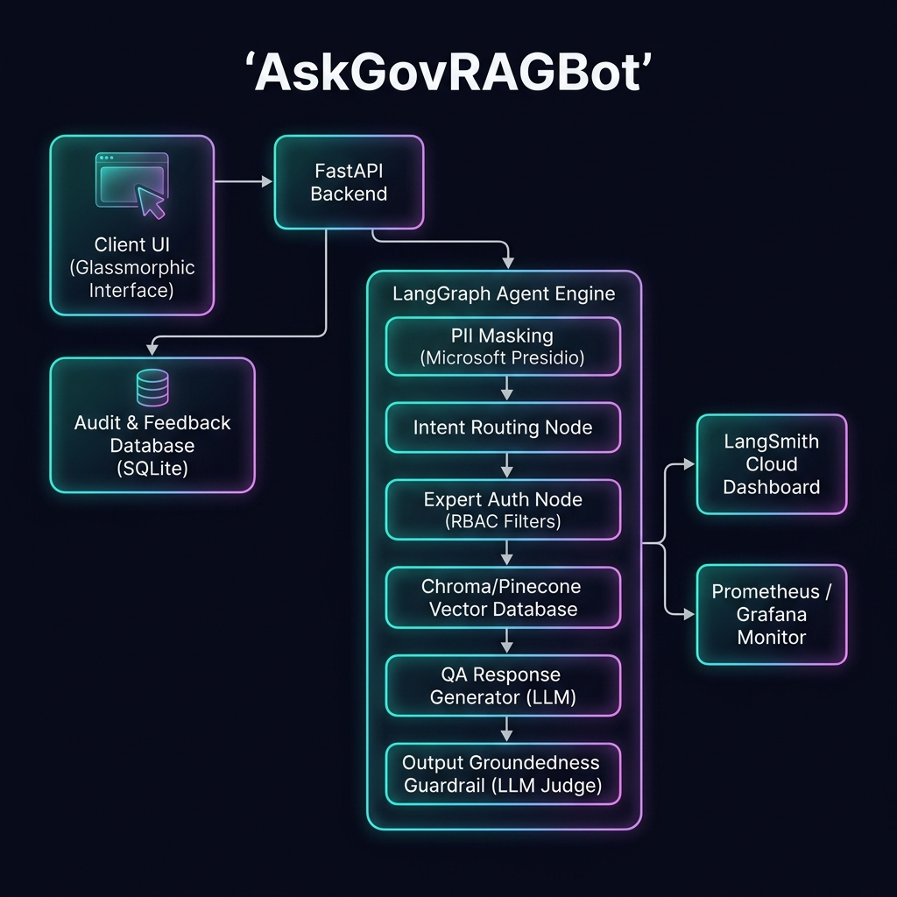
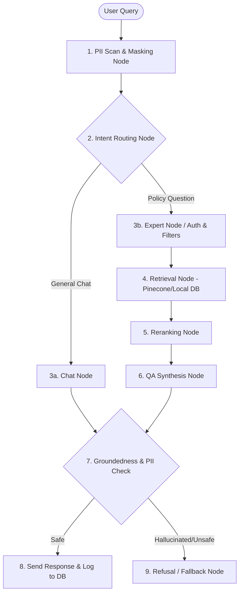
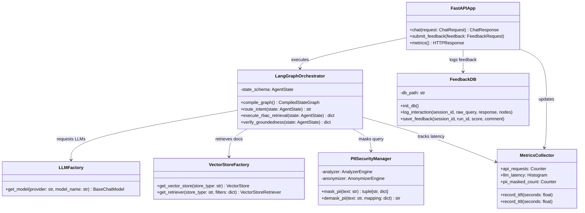
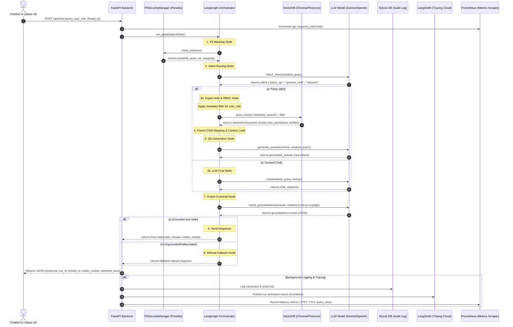

# AskGovRAGBot - Design Discussion & Architecture Specification

This document serves as the comprehensive design ledger, architectural mapping, and technical decision log for the **AskGovRAGBot** project. It details the transition of an enterprise-grade Oracle NetSuite Helidon architecture into a modern, open-source Python equivalent utilizing LangChain, LangGraph, FastAPI, and advanced observability tools.



---

## 1. Executive Summary & Brainstorming Transcript Log

### User Query Context
The user previously built a retrieval-augmented generation (RAG) chat service at NetSuite Oracle.
* **Original Stack**: Helidon REST API backend, Cohere embedding model, Oracle Vector DB, OCI GenAI LLM (via OCI SDK).
* **Original Flow**: An askoracle chatbot sent requests to a Graph Orchestrator. The orchestrator routed the request to an Expert Node behind a switch. The Expert Node handled auth, generated JWTs, constructed request payloads (user prompt, role, permissions, preferences), and sent HTTP calls to the Helidon chat service.
* **Original Ingestion**: Technical documents (XML) collected in an OCI bucket $\rightarrow$ converted to JSON chunks $\rightarrow$ stored in DB $\rightarrow$ triggered queue message to embedding service $\rightarrow$ converted to Cohere embeddings $\rightarrow$ saved to DB.

### Modernization Goal
Rebuild this governed architecture inside the Python open-source ecosystem, satisfying the Mastering Agentic AI cohort guidelines for Week 2 RAG projects, incorporating:
1. **LangChain & LangGraph**: Orchestrating agent workflows and state machines.
2. **LangSmith**: Trace logging and debugging (keeping within the 5,000 monthly free tier).
3. **Role-Based Access Control (RBAC)**: Gating information based on Contractor, Employee, Manager, and Admin permissions.
4. **Data Governance & Privacy**: In-flight PII masking (names, emails, phone numbers).
5. **Observability**: Prometheus metrics (including TTFT and TTLT) and Grafana.
6. **Robust Evaluator**: Offline evaluation script measuring Groundedness, Recall, and Relevance.

---

## 2. Why LangChain, LangGraph, and Agentic RAG?

### Why LangChain?
LangChain provides the essential abstractions for building LLM applications. Instead of locking ourselves into a single model provider (e.g., OCI GenAI SDK or OpenAI SDK) or vector database API, LangChain offers standard classes like `BaseChatModel` and `VectorStore`. This enables a clean factory pattern in our backend: swapping from Google Gemini to OpenAI, or switching from Chroma to Pinecone, requires only modifying a single string in an environmental variable.

### Why LangGraph?
Standard RAG is linear (Retrieve $\rightarrow$ Augment $\rightarrow$ Generate). Real-world enterprise systems are cyclic and conditional. 
* **Stateful Routing**: LangGraph models workflows as directed graphs. When a query is received, an intent node routes execution dynamically.
* **Checkpoints and Memory**: LangGraph's in-memory checkpointer keeps per-session workflow state during a running process, while SQLite persists audit logs, feedback, and cache tables across runs.
* **Mid-Workflow Interventions**: We can easily write custom code blocks (nodes) to perform PII masking, token validation, and metadata mapping before querying the database.

### How Agentic RAG Differs from Naive RAG
Naive RAG blindly feeds the user query to a database, grabs the top-k documents, and feeds them to an LLM. This causes hallucinations, data leaks, and high costs.
* **Agentic RAG** introduces reasoning *before*, *during*, and *after* retrieval:
  1. **Before Retrieval**: An **Intent Router** classifies whether retrieval is even necessary. The **Expert Node** analyzes the user's role and attaches strict permission constraints to the database query.
  2. **During Retrieval**: The agent evaluates search results, potentially applying re-ranking or query expansion.
  3. **After Retrieval**: An **Output Guardrail Node** evaluates the generated answer. If the answer is ungrounded (hallucinated), the agent intercepts it and routes it to a refusal path rather than showing false data to the user.

---

## 3. Technology Stack & Tradeoffs Spec

| System Component | Technology Chosen | Tradeoffs & Alternatives considered |
| :--- | :--- | :--- |
| **Ingestion Parser** | Python `xml.etree.ElementTree` & `json` | **Custom Parser vs. Naive Text Loaders**: Custom parsing allows us to read structured tag attributes (like `<subpolicy min_permission="3">`) and map them to metadata during ingestion, which naive TXT/PDF loaders cannot do. |
| **Chunking Strategy** | Tag-Aware Hierarchical Chunking | **Tag-Aware vs. Naive Semantic**: We split on XML section boundaries so sentences aren't cut in half. We index child summaries but return parent context chunks to avoid losing surrounding context during generation. |
| **Vector DB** | **ChromaDB** (Local) & **Pinecone** (Cloud) | **Local SQLite vs. Managed Cloud**: Chroma runs locally inside the project folder with $0 setup cost. Pinecone scales to millions of vectors in production but requires API credentials. Both share a unified LangChain API. |
| **Embeddings** | **Cohere** `embed-english-v3.0` & Local **BGE-Large** | **1024-Dimension vs. 384-Dimension**: Low-dimension embeddings (like `all-MiniLM-L6-v2`) are fast but fail on complex policy semantics. BGE-Large and Cohere (1024d) provide industry-standard retrieval recall. |
| **PII Masking** | **Microsoft Presidio** + Regex | **Presidio vs. Standard Regex**: Plain regex fails on naming variations (e.g. distinguishing a person's name from a city name). Presidio uses spaCy NLP models to detect entities contextually, keeping data private. |
| **Intent Router** | LangChain `StructuredOutput` (Fast LLM) | **LLM-based Router vs. Regex**: Regex is fast but fails on natural language nuance (e.g. separating a general question from a policy question). A fast model like Gemini Flash gets 99% accuracy immediately. |
| **State Database** | **SQLite (Persistent RDBMS)** | **ACID SQL RDBMS vs. Session/NoSQL**: SQLite is used for persistent conversation states, audit logging, and user feedback tracking. Rather than simple session-based memory (which disappears on server restarts), SQL persistence ensures long-term audit logs, chat history reloading across runs, and structured feedback records to dynamically export new evaluation datasets. |
| **Background Queue** | FastAPI `BackgroundTasks` | **Asynchronous Worker vs. Kafka/Celery**: `BackgroundTasks` executes long-running output groundedness checks and logs feedback data asynchronously. This ensures zero latency penalty on the client response, while safely persisting transaction details to SQLite and generating evaluation datasets in the background. |
| **Caching Strategy** | SQLite Cache Tables / Future Runtime Cache | **Prepared KV Cache vs. Active API Calls**: SQLite tables and helpers exist for embedding and LLM response caching, but runtime calls currently go directly through the configured model/vector-store path. |
| **Observability** | **LangSmith** & **Prometheus / Grafana** | **SaaS vs. Self-hosted**: LangSmith provides deep trace analysis for development (free up to 5k/mo). Prometheus gathers performance histograms (TTFT, TTLT, search speeds) to view in Grafana. |

---

## 4. End-to-End Workflow & Execution Path

The diagram below depicts the runtime execution of a user query through **AskGovRAGBot**:



### Detailed Execution Steps:
1. **Request Intake**: FastAPI receives user query, session thread ID, and authenticated user role (Contractor, Employee, Manager, Admin).
2. **PII Masking**: Presidio scans the text. If user role is Employee/Contractor, it masks sensitive items (e.g., names/phone numbers) in the transaction state.
3. **Intent Classification**: The router node evaluates the query. Unsafe injection attempts or non-policy prompts are immediately refused.
4. **RBAC Filtering**: The expert node checks the user's role and constructs a filter payload:
   * Contractor: `{"min_permission_level": {"$lte": 1}}`
   * Employee: `{"min_permission_level": {"$lte": 2}}`
   * Manager: `{"min_permission_level": {"$lte": 3}}`
   * Admin: `{"min_permission_level": {"$lte": 4}}`
5. **Retrieval**: The retriever queries the Vector database using the constructed filters. If a contractor asks a manager-level question, search returns `0` documents.
6. **Synthesis**: The retrieved chunks and system prompt are formatted into the LLM context.
7. **Groundedness Guardrail**: The LLM-as-a-judge node compares the output against retrieved text. If the LLM referenced facts not in the context, it is rejected.
8. **Logging, Caching & Persistent Metrics**: The query, masked query, retrieved chunks, generated response, and node execution paths are logged into our persistent SQLite database. The conversation checkpointer persists session states so history is available across future runs. Finally, latency (TTFT and TTLT) is scraped by Prometheus, and a LangSmith trace is published. Feedback buttons allow users to log thumbs-up/down ratings.

---

## 5. Real-World Use Case Demonstration: AuraTech HR

To showcase this architecture, we seed our database with an HR policy corpus for a mock company, **AuraTech**:

* **Use Case A: Contractor Access Blocked**
  * *User*: "Contractor Bob" (Role Level 1)
  * *Query*: "What is the budget policy for department managers?"
  * *Expert Node filter*: `{"min_permission_level": {"$lte": 1}}`
  * *Result*: Zero documents retrieved. The bot politely refuses to answer.
  
* **Use Case B: PII Masking in Action**
  * *User*: "Employee Alice" (Role Level 2)
  * *Query*: "Help me email HR manager John Doe at john.doe@auratech.com about my benefits."
  * *Masking Node*: Replaces email with `[REDACTED_EMAIL_1]` and name with `[REDACTED_NAME_1]`.
  * *LLM Generation*: Safe response containing the masked values. Mappings are kept private.
  
* **Use Case C: Hallucination Refusal**
  * *User*: "Manager Charlie" (Role Level 3)
  * *Query*: "What is the company stock benefit vesting schedule?"
  * *Retrieved Context*: Only mentions standard 401(k) matches; no vesting document is found.
  * *Output Guardrail*: Catches that the LLM tried to hallucinate a "4-year vesting schedule". Rejects response, routing to the Refusal node to output: *"I cannot verify this policy in the system database. Please consult HR."*

---

## 6. Architectural Scaling: Real-Time Streaming with Apache Flink
For enterprise scaling where policies are modified daily:
1. Document changes in Google Drive or Slack trigger events.
2. Events stream into an **Apache Kafka** topic.
3. An **Apache Flink** cluster consumes the document stream, executing real-time chunking, cleaning, and embedding tasks on the stream.
4. Flink upserts vectors into the **Pinecone** index, ensuring document latency is under 1 second without requiring batch indexing cron jobs.

---

## 7. Unified Class & System Design Blueprint

This section defines the class structure and sequence workflows that implement our RAG agent.

### A. Python Class Structure (Architecture Diagrams)

#### Class Diagram (System Components)


---

### B. End-to-End Sequence Diagram (Query Life Cycle)

The following sequence diagram outlines the synchronous client request combined with asynchronous evaluation and tracing loops:



---

### C. State Class Definitions & Schemas

To pass variables between graph nodes, we define a strict Python schema using Pydantic models and TypedDicts:

```python
from typing import Dict, List, Optional, TypedDict
from pydantic import BaseModel, Field
from langchain_core.messages import BaseMessage

# LangGraph State Schema
class AgentState(TypedDict):
    # Inputs
    query: str                          # Original user query
    user_role: str                      # User role: Contractor/Employee/Manager/Admin
    user_permission: int                # Permission integer level (1 to 4)
    thread_id: str                      # Session identifier

    # State variables
    masked_query: str                   # Prompt after Presidio masking
    pii_mapping: Dict[str, str]         # Map of placeholder -> raw entity
    intent: str                         # Classifed intent: policy_qa / general_chat / refused
    
    # Document Retrieval
    retrieved_docs: List[dict]          # Retrieved document snippets & metadata
    parent_context: str                 # Complete parent context text fed to LLM
    
    # Outputs
    response: str                       # Output generated by LLM
    is_grounded: bool                   # Groundedness guardrail output flag
    refusal_reason: Optional[str]       # Detail on why a query was refused (if any)
    nodes_visited: List[str]            # Traced node path (for UI visualization)
    
    # Memory
    chat_history: List[BaseMessage]     # Persistent conversation memory buffer
```

---

### D. Groundedness Evaluation Prompt Spec (LLM-as-a-Judge)

The Output Guardrail uses a fast model (like Gemini Flash) configured with a strict Pydantic return format. The prompt template enforces zero tolerance for claims outside the retrieved corporate policy documents:

```
[SYSTEM PROMPT]
You are a strict compliance auditor. Your job is to verify if the generated answer is completely and faithfully grounded in the retrieved document context. 

[CONTEXT]
{retrieved_context}

[GENERATED ANSWER]
{generated_answer}

[INSTRUCTIONS]
1. Read the Context and the Generated Answer carefully.
2. Check if the Generated Answer contains any factual claims, numbers, URLs, policies, or statements that are NOT explicitly mentioned in the Context.
3. If the answer makes up details, or assumes details not directly written in the Context, set "grounded" to false.
4. Output your response strictly as a JSON object matching the requested schema.

[OUTPUT SCHEMA]
class GroundednessSchema(BaseModel):
    grounded: bool = Field(description="True if the answer contains ONLY facts from the Context, False otherwise.")
    hallucinated_claims: List[str] = Field(description="List of statements in the answer that could not be verified in the Context.")
    reasoning: str = Field(description="Step-by-step reasoning explaining your grading decision.")
```

---

*Note: To inspect the complete implementation files, open this repository as your active IDE workspace.*
