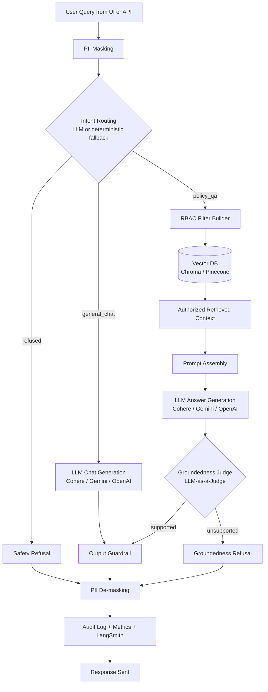

# AskGovRAGBot

AskGovRAGBot is a secure Retrieval-Augmented Generation (RAG) chatbot built with FastAPI, LangChain/LangGraph, and vector search. It is designed for policy and knowledge retrieval with role-based access control, PII masking, groundedness guardrails, and observability.

## What This App Does

AskGovRAGBot lets a user ask corporate policy questions through a governed chat UI. The backend masks PII, routes the query, retrieves only documents the user's role is allowed to see, generates an answer from retrieved policy context, checks groundedness, restores safe local PII mappings, and logs the interaction for audit and observability.

## Table of Contents

- [Features](#features)
- [Tech Stack](#tech-stack)
- [Architecture Overview](#architecture-overview)
- [Quick Start](#quick-start)
- [API Docs and Endpoints](#api-docs-and-endpoints)
- [Ingestion and Vector Store](#ingestion-and-vector-store)
- [Testing and Evaluations](#testing-and-evaluations)
- [Observability](#observability)

## Features

- Role-based access control (RBAC) filters retrieval by user permission level.
- Tag-aware ingestion and chunking for XML/JSON policy documents.
- Vector search with semantic retrieval and metadata filtering.
- In-flight PII masking and local de-masking for safer external model calls.
- Output groundedness validation to reduce hallucinations.
- Static browser UI backed by FastAPI.
- Swagger/ReDoc API documentation from FastAPI.
- Prometheus metrics and LangSmith trace instrumentation.
- Persistent SQLite audit ledger, feedback records, and cache tables.

## Tech Stack

| Layer | Technology |
| --- | --- |
| UI | Static HTML, CSS, vanilla JavaScript |
| API | FastAPI, Pydantic, Uvicorn |
| Agent workflow | LangGraph |
| LLM adapters | Gemini, OpenAI, Cohere, Nebius-compatible OpenAI endpoint |
| Embeddings | Local fallback, Cohere, OpenAI |
| Vector store | Chroma locally, Pinecone or Qdrant support |
| Policy ingestion | Custom XML/JSON tag-aware parsers |
| Security | Regex/Presidio-style PII masking, RBAC metadata filters |
| Persistence | SQLite audit/feedback/cache tables |
| Observability | Prometheus metrics, LangSmith tracing |
| Evals/tests | Pytest, Ragas-based evaluation script |

## Architecture Overview

AskGovRAGBot is structured around a gated RAG workflow with the following core components:

- **FastAPI backend**: exposes `/api/chat` and `/api/feedback` endpoints and can serve the frontend UI when `SERVE_FRONTEND=true`.
- **LangGraph state machine**: orchestrates the chat flow, including intent routing, retrieval, LLM generation, and groundedness evaluation.
- **Vector database**: stores document chunks and metadata for semantic retrieval using Chroma or Pinecone.
- **Embedding provider**: generates text embeddings with Cohere, OpenAI, or local models.
- **PII masking**: detects and masks sensitive user data before sending prompts to external LLM APIs.
- **Groundedness guardrail**: uses the active chat model to validate answers against retrieved context and blocks hallucinations.
- **Prometheus metrics**: exposes application metrics for request latency, PII masking, and groundedness events.
- **LangSmith tracing**: optional observability for execution graphs, LLM traces, token usage, and latency.

### High-level Flow



## Repo Structure

- `app/` - main backend logic
- `frontend/` - static UI assets
- `scripts/` - ingestion and evaluation helpers
- `data/` - policy documents and local vector DB storage
- `tests/` - test cases and evaluation scripts
- `requirements.txt` - Python dependencies

## Quick Start

### 1. Configure `.env`

Copy the sample environment template and configure your credentials:

```bash
cp .env.example .env
```

Edit `.env` and set values for:

- `VECTOR_STORE` - `chroma` or `pinecone`
- `LLM_PROVIDER` - `cohere`, `gemini`, or `openai`
- `LLM_MODEL`
- `EMBEDDING_PROVIDER`
- `COHERE_API_KEY`, `GOOGLE_API_KEY`, `OPENAI_API_KEY`
- `PINECONE_API_KEY`, `PINECONE_INDEX_NAME` (if using Pinecone)
- `LANGCHAIN_TRACING_V2`, `LANGCHAIN_API_KEY`, `LANGSMITH_API_KEY`

For local development with the generated Chroma DB, this is a good baseline:

```env
VECTOR_STORE=chroma
LLM_PROVIDER=gemini
LLM_MODEL=gemini-2.5-flash
EMBEDDING_PROVIDER=cohere

GOOGLE_API_KEY=your_google_api_key_here
COHERE_API_KEY=your_cohere_api_key_here

LANGCHAIN_TRACING_V2=true
LANGCHAIN_ENDPOINT=https://api.smith.langchain.com
LANGSMITH_API_KEY=your_langsmith_key_here
LANGCHAIN_API_KEY=your_langsmith_key_here
LANGCHAIN_PROJECT=AskGovRAGBot

SERVE_FRONTEND=true
```

Restart Uvicorn after changing `.env`; hot reload does not always re-read environment variables.

For the local Chroma DB, keep `EMBEDDING_PROVIDER=cohere` unless you re-run ingestion with a different embedding provider. Query embeddings should match the embedding model used to seed the vector store.

### 2. Create and Activate the Virtual Environment

```bash
python3 -m venv venv
source venv/bin/activate
```

### 3. Install dependencies

```bash
python -m pip install --upgrade pip setuptools wheel
python -m pip install -r requirements.txt
```

### 4. Seed the vector index

Run ingestion on first setup, or any time the vector DB is missing, stale, or you changed files in `data/`:

```bash
python scripts/ingest_policies_db.py
```

The generated local Chroma DB lives under `data/chroma_db/` and is not committed. After ingestion, it is expected to contain 15 vectors from:

- `data/hr_policy.xml`
- `data/it_security_policy.json`
- `data/developer_handbook.xml`

### 5. Start the App and UI

Use `SERVE_FRONTEND=true` so FastAPI serves the static UI from `frontend/`:

```bash
SERVE_FRONTEND=true uvicorn app.main:app --host 0.0.0.0 --port 8000 --reload
```

After the server starts, open:

- App UI: http://localhost:8000
- Swagger API docs: http://localhost:8000/docs
- ReDoc API docs: http://localhost:8000/redoc
- Raw OpenAPI schema: http://localhost:8000/openapi.json
- Raw Prometheus metrics: http://localhost:8000/metrics

For observability dashboards:

- LangSmith: https://smith.langchain.com, then open the `AskGovRAGBot` project after sending a chat query.
- Prometheus: run this in another terminal, then open http://localhost:9090:
  ```bash
  docker run -p 9090:9090 \
    -v $(pwd)/prometheus.yml:/etc/prometheus/prometheus.yml \
    prom/prometheus
  ```

If you do not use `SERVE_FRONTEND=true`, the backend is API-only and you can open `frontend/index.html` separately.

## API Docs and Endpoints

FastAPI automatically exposes interactive API documentation:

- Swagger UI: http://localhost:8000/docs
- ReDoc: http://localhost:8000/redoc
- OpenAPI JSON: http://localhost:8000/openapi.json

Main endpoints:

| Method | Path | Purpose |
| --- | --- | --- |
| `POST` | `/api/chat` | Run the governed RAG workflow for a user query. |
| `POST` | `/api/feedback` | Store thumbs-up/down feedback and optional comments. |
| `GET` | `/metrics` | Expose Prometheus metrics in plaintext format. |

Example chat request:

```bash
curl -X POST http://localhost:8000/api/chat \
  -H "Content-Type: application/json" \
  -d '{
    "query": "What is the hybrid office attendance requirement?",
    "user_role": "Employee",
    "session_id": "demo-session"
  }'
```

## Ingestion and Vector Store

The knowledge base is built from structured policy files in `data/`.

| Source file | Category | Stored chunks |
| --- | --- | --- |
| `data/hr_policy.xml` | HR | 8 |
| `data/it_security_policy.json` | IT | 4 |
| `data/developer_handbook.xml` | Dev | 3 |

The ingestion script:

- parses XML/JSON policy structures,
- chunks by policy section,
- attaches metadata such as `policy_id`, `category`, `source`, and `min_permission_level`,
- embeds the chunks,
- stores vectors in the configured vector store.

Run ingestion only when source documents, embedding settings, or vector store settings change:

```bash
python scripts/ingest_policies_db.py
```

Local development defaults to Chroma in `data/chroma_db`. If `VECTOR_STORE=pinecone`, ingestion writes to Pinecone instead.

## Testing and Evaluations

Run unit/integration tests:

```bash
pytest tests/test_rag.py -v
```

Run offline evaluations:

```bash
python scripts/evaluate.py
```

The evaluator runs a policy/RBAC/PII/guardrail test corpus and writes its Markdown report to:

```text
artifacts/evaluation_results.md
```

When Cohere is configured, the evaluator can also compute Ragas metrics such as faithfulness and answer relevancy. If external API keys are missing, parts of the app fall back to local/mock behavior where supported.

## Observability

### LangSmith

Enable tracing in `.env`:

```env
LANGCHAIN_TRACING_V2=true
LANGCHAIN_ENDPOINT=https://api.smith.langchain.com
LANGSMITH_API_KEY=your_langsmith_key_here
LANGCHAIN_API_KEY=your_langsmith_key_here
LANGCHAIN_PROJECT=AskGovRAGBot
```

Then restart Uvicorn and open:

```text
https://smith.langchain.com
```

Look for the `AskGovRAGBot` project.

### Prometheus

First confirm the app metrics endpoint works:

```text
http://localhost:8000/metrics
```

Then start Prometheus:

```bash
docker run -p 9090:9090 \
  -v $(pwd)/prometheus.yml:/etc/prometheus/prometheus.yml \
  prom/prometheus
```

The included `prometheus.yml` uses `host.docker.internal:8000` so a Prometheus container can scrape the FastAPI server running on your Mac/Windows host. If you run Prometheus directly on the host instead of Docker, use `localhost:8000`.

Open:

```text
http://localhost:9090
```

Useful metric queries:

```text
askgovragbot_api_requests_total
askgovragbot_request_duration_seconds_count
askgovragbot_pii_masked_total
askgovragbot_hallucinations_detected_total
```

## Notes

- Use `VECTOR_STORE=chroma` for local development unless you explicitly want Pinecone.
- Keep `EMBEDDING_PROVIDER` aligned with the model used during ingestion; the generated local Chroma DB should be seeded and queried with Cohere embeddings by default.
- Use `LANGCHAIN_TRACING_V2=true` with LangSmith credentials when you want trace visualization.
- If `pip install -r requirements.txt` or `pip --version` hangs, see `TROUBLESHOOTING_LOG.md`.
- Do not commit `.env` or local data caches.
- The repository already ignores `venv/`, `.env`, `.DS_Store`, local DB files, and caches.

## Related Documentation

- `DESIGN_DISCUSSION.md` - architecture rationale
- `INGESTION_KNOWLEDGE_BASE.md` - ingestion pipeline details
- `VECTOR_ENGINEERING.md` - vector search and reranking details
- `TELEMETRY_&_METRICS_LOG.md` - observability and metrics manual
- `QUERIES.md` - test corpus and RBAC validation
- `TROUBLESHOOTING_LOG.md` - development issue log
